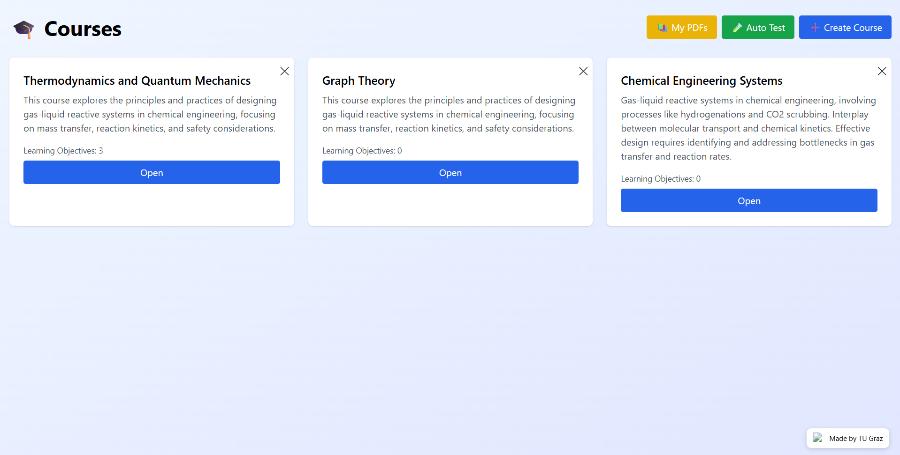
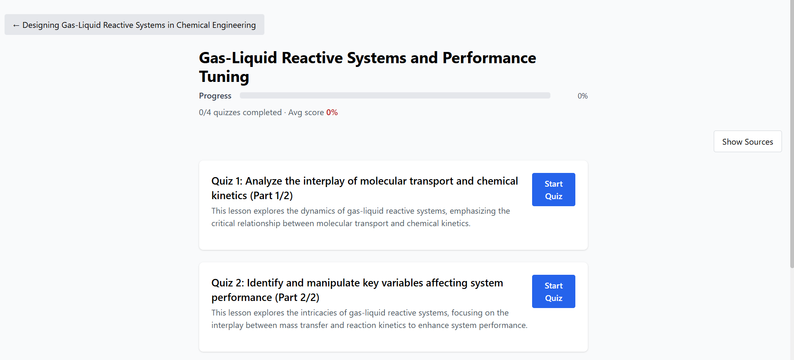

# LearnApp — AI-Powered Course Generation Platform

> **MSc Thesis Project · TU Graz · Full-Stack AI/NLP System**

An end-to-end platform that transforms raw educational PDFs into structured, interactive courses — using LLM-driven semantic chunking, learning objective induction, and automated evaluation. Built as part of my Master's thesis in Computer Science.

---

## What It Does

LearnApp eliminates manual course-authoring effort. Upload a PDF, and the system automatically:

1. **Segments** the document into semantically coherent content chunks
2. **Groups** chunks into thematic learning objectives
3. **Generates** structured lessons with quizzes and questions
4. **Evaluates** output quality through an automated benchmarking framework

---

## Key Technical Contributions

### 🔷 LLM-Based Semantic Chunking
Rather than naive fixed-length splitting, the system uses topic-aware LLM prompting to identify conceptual boundaries within documents. PDFs are first converted to structured JSON (via Docling/PyMuPDF), then segmented by an LLM that reasons about topic continuity — producing chunks that preserve meaning across section boundaries.

### 🔷 Learning Objective Induction & Grouping
Chunks are grouped into thematic learning objectives using two interchangeable strategies:
- **OpenAI provider** — LLM uses chunk titles, summaries, and keywords to propose and describe groups
- **Heuristic provider** — Embedding-based clustering (k-means with √N heuristic) for offline/cost-free use

Both paths generate structured LO metadata: title, summary, and bullet-point objectives. Instructors can manually refine, merge, split, and reorder via the UI.

### 🔷 Autotest & Evaluation Framework
A fully automated benchmarking layer for systematic, repeatable evaluation of LLM pipeline outputs:
- Generates synthetic multi-topic test PDFs from a text pool
- Runs configurable test suites (variable PDF count, page ranges, chunking configs)
- Produces CSV reports, JSON artefacts, and visualizations
- Enables experiment-style analysis of chunking quality and LO grouping accuracy

---

## Tech Stack

| Layer | Technologies |
|---|---|
| **Backend** | FastAPI, Pydantic, Python 3.10+ |
| **AI / NLP** | OpenAI API, sentence-transformers, Docling, PyMuPDF, pdfminer |
| **Database** | MongoDB + GridFS |
| **Frontend** | React, React Router, Axios, TailwindCSS |
| **Evaluation** | Custom autotest framework, CSV/JSON/plot outputs |

---

## System Architecture
```
PDF Upload → Text Extraction → Markdown Conversion → Structured JSON
    → Semantic Chunking → Metadata Enrichment
    → LO Grouping (Embedding or LLM)
    → Lesson & Quiz Generation
    → MongoDB Storage
    → React Course Interface
```

The FastAPI backend exposes modular API routes supporting both **fully automated** pipeline execution and **stepwise debug modes** for inspecting intermediate states.

---

## Screenshots


*Course dashboard — browse and manage all courses*


*Learning objectives overview with progress tracking*


*Manual LO refinement — edit title, summary, and objectives inline*


*Lesson navigation with inline PDF source preview*

---

## Project Structure
```
.
├── backend/
│   ├── main.py
│   ├── app/
│   │   ├── routers/         # API route definitions
│   │   ├── providers/       # OpenAI & heuristic LO providers
│   │   ├── services/        # Chunking, LO, lesson generation logic
│   │   ├── utils/
│   │   ├── models.py
│   │   └── schemas.py
│   └── Tests/               # Autotest & benchmark suite
└── frontend/
    └── src/
```

---

## Local Setup

### Prerequisites
- Python 3.10+, Node.js 18+, MongoDB (local or hosted)

### Backend
```bash
cd backend
python -m venv venv && source venv/bin/activate
pip install -r requirements.txt
uvicorn main:app --host 0.0.0.0 --port 8001 --reload
```

Create `backend/.env`:
```env
MONGO_URL=mongodb://localhost:27017
DB_NAME=learnapp
AI_PROVIDER=heuristic          # or 'openai'
# OPENAI_API_KEY=sk-...        # required for OpenAI provider
```

### Frontend
```bash
cd frontend && npm install && npm start
```

- Backend health check: `http://localhost:8001/api/health`
- Frontend: `http://localhost:3000`

---

## Research Context

**Thesis title:** *"Topic-Aware Semantic Segmentation and Learning Objective Induction from Educational Content using Large Language Models"* — TU Graz, MSc Computer Science

Core research areas demonstrated:
- Applied LLM integration in production-style NLP pipelines
- Embedding-based document segmentation and grouping
- Evaluation-driven development methodology
- Full-stack system design (REST API + document DB + React UI)

---

## License

MIT License
