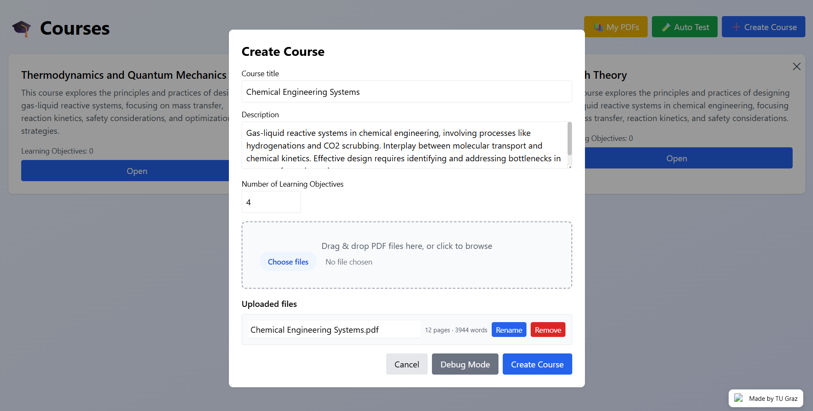
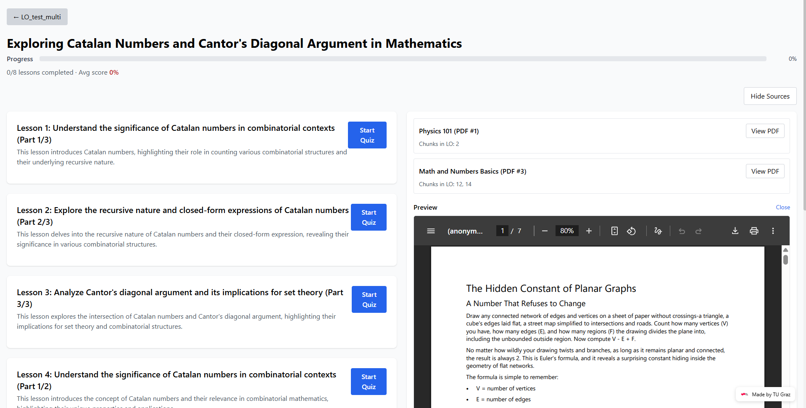

# LearnApp – LLM-Based Course Generation & Evaluation Platform

End-to-end AI-assisted learning platform that transforms raw educational PDFs into structured courses consisting of semantically coherent content chunks, learning objectives, lessons, and quizzes.

Developed as part of my MSc thesis in Computer Science at TU Graz, graded **1.0/5.0 (highest possible grade)**.
The system is already **used and further developed by the institute** as a framework for future projects.

---

## Overview

LearnApp was built to reduce manual course-authoring effort by converting unstructured educational documents into structured, usable learning content.

The project focuses on both **research and engineering**. A large part of the work went into investigating, designing, and refining **AI-based chunking and grouping methods**, while also building a complete full-stack system around them.

Core components:

1. **Semantic Chunking (LLM + heuristics)**
2. **Learning Objective Generation & Grouping**
3. **Evaluation & Autotest Framework**
4. **Course, Lesson, and Quiz Generation**

This project combines **research-driven development** with **production-style system design**.

---

## Why this project matters

Most educational material exists as PDFs, slides, or long documents that are easy to distribute but difficult to use interactively.

LearnApp addresses this by turning unstructured source material into structured learning units that can be navigated, edited, evaluated, and extended.

More broadly, the project shows how LLMs can be used in a controlled way to:

* extract structure from messy documents
* generate machine-readable intermediate representations
* support downstream applications instead of one-off prompts
* evaluate AI output systematically rather than relying on intuition

This type of pipeline is also applicable beyond education (e.g., document analysis, knowledge extraction, due diligence workflows).

---

## System Architecture

The system follows a modular pipeline:

PDF Upload
→ Text Extraction
→ Structured JSON Conversion
→ Semantic Chunking
→ Metadata Enrichment
→ Learning Objective Generation & Grouping
→ Lesson & Quiz Generation
→ Storage (MongoDB + GridFS)
→ React-based Course Interface

Key aspects:

* modular FastAPI backend
* React frontend for course creation and learning workflows
* MongoDB + GridFS for persistent storage
* integration of external LLM providers
* stepwise execution and debugging of pipeline stages

---

## Example Output

### Course Creation



### Course Overview



### Chunks and Learning Objectives


The system allows:

* multi-document course creation
* structured navigation through generated content
* inspection of intermediate pipeline outputs

---

## Core Technical Contributions

### 1) Semantic Chunking

A major focus of this work was designing methods to split long educational documents into semantically meaningful segments.

Instead of relying on fixed-length splits or simple similarity thresholds, the system uses:

* LLM-guided boundary detection
* heuristic pre- and post-processing
* structured paragraph representations
* constraint-aware chunk refinement

The goal was to create chunks that are:

* semantically coherent
* stable enough for downstream processing
* suitable for grouping into higher-level learning objectives

This required extensive experimentation to balance coherence, consistency, and size constraints.

---

### 2) Structured LLM Integration

LLMs are integrated as part of a **controlled multi-stage pipeline**, not as standalone generators.

Key design decisions:

* strict JSON-based outputs
* explicit schemas for intermediate representations
* separation between processing stages
* validation and correction steps

This makes outputs:

* machine-readable
* reproducible
* easier to debug and evaluate

---

### 3) Learning Objective Generation & Grouping

After chunking, the system groups related content into coherent learning objectives.

This stage supports:

* LLM-based grouping
* embedding-based / heuristic grouping
* automatic metadata generation
* manual refinement via UI

Each learning objective includes:

* title
* summary
* bullet-point objectives
* associated source chunks

---

### 4) Evaluation & Autotest Framework

A key contribution of the project is systematic evaluation.

The system includes:

* synthetic dataset generation
* automated benchmark runs
* controlled experiments across configurations

Tracked metrics include:

* Precision / Recall / F1 (boundary quality)
* chunk count deviation
* size constraint violations
* positional error

Scale:

* **3,400+ automated runs**
* **139k+ processed pages**
* **96k+ topic segments**

This ensures the system is evaluated beyond subjective inspection.

---

### 5) Full-Stack System Design

LearnApp is a complete application, not just a prototype.

Includes:

* backend APIs for all pipeline stages
* database-backed storage
* frontend for editing and navigation
* debug interfaces for intermediate states

---

## Core Features

* Topic-aware semantic segmentation
* Learning objective generation and grouping
* Structured JSON-based LLM workflows
* Modular AI provider abstraction
* Step-by-step debugging interface
* Automated evaluation framework
* Lesson and quiz generation
* Progress tracking

---

## Tech Stack

### Backend

* FastAPI
* Pydantic
* MongoDB + GridFS
* OpenAI API (optional)

### Frontend

* React
* React Router
* Axios
* TailwindCSS

### AI / ML

* LLM APIs
* embedding-based similarity
* structured prompt engineering

### Document Processing

* pdfminer
* Docling
* PyMuPDF

---

## Repository Structure

```
.
├── backend/
├── frontend/
└── README.md
```

---

## Local Setup

### Backend

```bash
cd backend
python -m venv venv
source venv/bin/activate
pip install -r requirements.txt
uvicorn main:app --reload
```

### Frontend

```bash
cd frontend
npm install
npm start
```

---

## Research Context

Master’s thesis:

**“Topic-Aware Semantic Segmentation and Learning Objective Induction from Educational Content using Large Language Models.”**

Focus:

* semantic segmentation
* structured AI pipelines
* evaluation-driven development
* bridging research and real systems

---

## Real-World Use

The system is already **used and extended by the institute** and serves as a base for future projects.

---

## Key Takeaways

* LLMs require structure to be reliable
* chunking and grouping are non-trivial problems
* evaluation is essential
* research can be turned into usable systems

---

## License

MIT License
